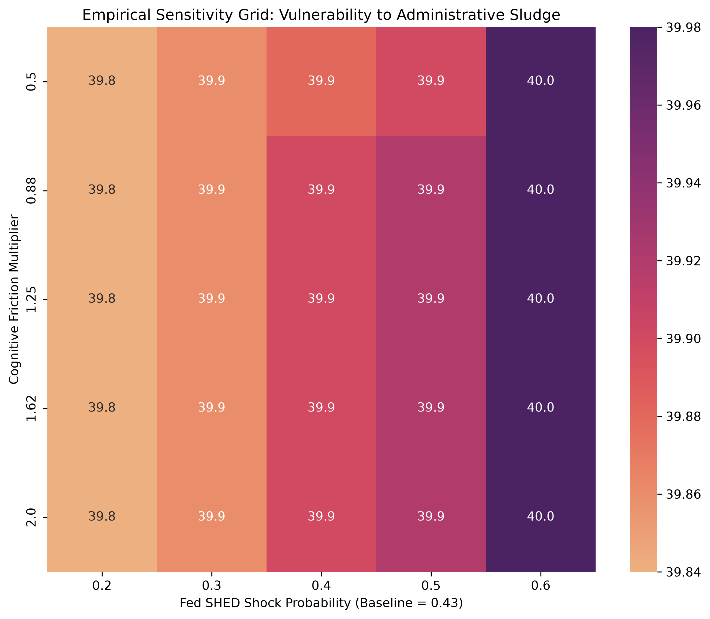

# The Cognitive Cost of Friction: A Stochastic Monte Carlo Microsimulation

**Status:** USRESP Manuscript Submitted (12-page format) | **Language:** Python (NumPy, Pandas, Seaborn)

## Architecture Overview
This repository houses a 5,000-agent stochastic microsimulation designed to model how administrative sludge and bureaucratic friction act as a continuous drain on cognitive bandwidth. By isolating these variables, the model maps the exact boundary conditions where financial capture becomes a deterministic floor-absorption process.

## Data & Empirical Calibration
Baseline shock probabilities and administrative friction constraints are calibrated using empirical moments derived from the **2025 Federal Reserve Survey of Household Economics and Decisionmaking (SHED)** public microdata.
* **Shock Probability ($p=0.4335$):** Extracted from SHED Variable `EF1`, representing the exact proportion of respondents unable to cover a baseline emergency expense without high friction.
* **Shock Magnitude:** Anchored to the Fed SHED $400 empirical emergency expense baseline. 

## Methodology & Epistemic Boundaries
This model utilizes parameterized continuous bandwidth evolution and empirically calibrated shocks to test the hypothesis that extreme financial distress is often a product of structural bandwidth depletion rather than baseline logic failure. 

**Note on Causal Inference:** This computational model shows what its parameters imply; it does not independently identify real-world causal effects. It serves as the theoretical mechanism design framework, intended to be paired with randomized administrative datasets for formal structural estimation.

## Core Mechanics
1. **Agent Generation:** 5,000 heterogeneous agents with baseline financial capital and cognitive bandwidth parameters.
2. **Empirical Shocks:** Introduction of financial shocks calibrated to the 2025 Fed SHED microdata.
3. **Bandwidth Depletion (Sludge):** A continuous drain function representing the administrative friction of navigating the shocks.
4. **2D Parameter Sensitivity Sweep:** A replication-based Monte Carlo grid evaluating capture thresholds across varying friction multipliers.

## Results: Calibrated Sensitivity Sweep
