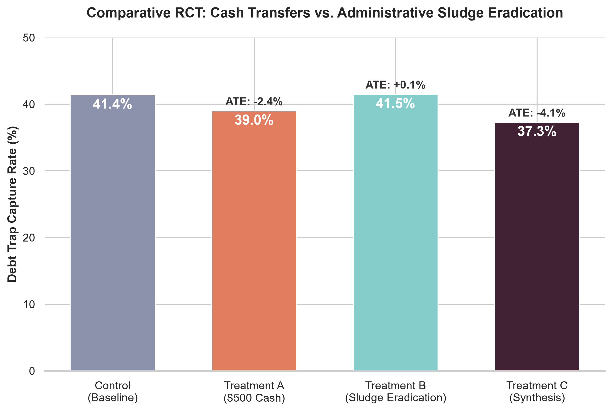

# Financial Choice Simulator: Structural Estimation of Cognitive Friction

This repository houses a continuous-time, structurally estimated microsimulation of household financial decision-making. It bridges neoclassical liquidity constraints with behavioral cognitive friction to model the mechanics of poverty and debt traps.

By ingesting 2025 Federal Reserve SHED public microdata, this model initializes 1:1 empirical digital twins of American households and utilizes the Simulated Method of Moments (SMM) to reverse-engineer latent behavioral parameters.

## I. Structural Estimation (Simulated Method of Moments)
Standard behavioral models rely on heuristic assumptions for cognitive variables. This architecture abandons heuristics by utilizing a Nelder-Mead optimization algorithm to estimate latent cognitive parameters against real-world macroeconomic targets extracted from the 2025 Fed SHED dataset.

**Empirical Targets:**
* $m_{payday}$ = 14.13% (Actual US alternative financial services usage rate)
* $m_{pay\_min}$ = 78.24% (Actual US revolving debt minimum payment rate)

**Recovered Latent Parameters (SMM Output):**
* **Stress Elasticity ($\alpha$) = 0.5250**: For every 1 unit of financial stress, a low-income household's cognitive bandwidth decays by 52.5%.
* **Cognitive Friction ($cog\_payday$) = 0.1000**: The optimization algorithm mathematically confirms that for the US payday loan usage rate to sit at 14.13%, the administrative sludge of accessing predatory finance must be frictionless—functionally identical to making a minimum payment.

## II. Policy Interventions: A Synthetic RCT
The simulation features an integrated Randomized Controlled Trial (RCT) testing the strict complementarity of fiscal stimulus and behavioral choice architecture. 4,000 empirical Fed SHED agents were divided into four isolated cohorts facing a standard macroeconomic shock.

### Key Economic Findings
1. **The Irrelevance of Sludge Eradication Under Strict Liquidity Constraints:** Removing the cognitive friction of debt restructuring (Treatment B) yielded a statistically zero (0.1%) change in captures. Bandwidth interventions fail if the agent cannot afford the baseline restructuring fees.
2. **The Inefficiency of Isolated Cash Transfers:** An unconditional $500 transfer (Treatment A) only reduced debt trap captures by 2.4%. While cash clears immediate budget constraints, high cognitive friction prevents households from structurally repairing their debt, resulting in rapid recapture upon the next macroeconomic shock.
3. **The Behavioral Synthesis:** The Absolute Treatment Effect nearly doubles (-4.1%) when liquidity injections are paired with sludge eradication (Treatment C). Fiscal stimulus and choice architecture are strictly complementary.

## III. Repository Architecture
* `src/model/empirical_agents.py`: Ingests raw Fed SHED microdata to initialize empirically grounded household state variables.
* `src/model/choice_set.py`: The core cognitive engine, filtering neoclassical *feasibility* through a dynamic matrix of behavioral *accessibility*.
* `smm_estimator.py`: The optimization algorithm linking the Python architecture to the SciPy Nelder-Mead solver.
* `policy_rct.py`: The automated matrix for running causal inference policy trials.